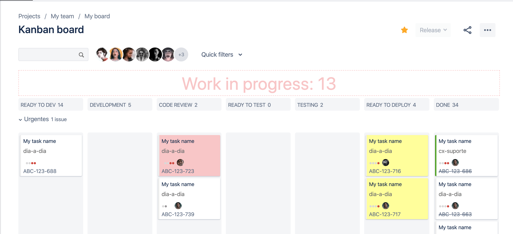

# Jira wip plugin

This extension changes Jira's board to show how many items are in WIP and to
highlight cards that are lingering for far too long in the same lane.

## Resources:

### To generate the .crx file
http://www.adambarth.com/experimental/crx/docs/packaging.html

### Updating a package

To create an updated version of the extension:

* Increase the version number in manifest.json.
* Bring up the Extensions management page by going to this URL: chrome://extensions
* Click the Pack extension button. A dialog appears.
* In the Extension root directory field, specify the path to the extension's folder.
* In the Private key file field, specify the location of the already generated .pem file for this extension—for example.
* Click OK.
